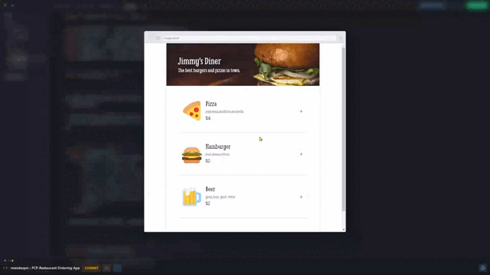

# Restaurant Ordering App

## *Overview* 🌟

This project is part of the Essential JavaScript Concepts module in [**Scrimba**](https://v2.scrimba.com/home)’s [**Frontend Career Path**](https://v2.scrimba.com/the-frontend-developer-career-path-c0j).

This is a web app that allows users to view a menu, add and remove items from their order, and complete a purchase through a payment modal form. Additional features include displaying an order summary and showing a confirmation message after payment.

## *Requeriments* 📝

✅ ~~Follow the design spec.~~

✅ ~~Render the three menu options using JavaScript.~~

✅ ~~Be able to add/remove items.~~

✅ ~~Have a payment modal with compulsory form inputs.~~

## *Stretch Goals* 💪

❌ Change the theme.

❌ Offer a "meal deal" discount.

❌ Allow users to rate their experience ⭐⭐⭐

## *Pseudocode* 🖥️

1. Import Menu Data
    + Import menuArray from a data file.

1. Initialize DOM Elements

1. Initialize Current Order Array
    + Create an empty array `currentOrder` to store selected menu items.

1. Set Up Event Listeners on Page Load
    + On DOMContentLoaded:
        + Render the menu.
        + Add listeners to handle clicks on "+" buttons and to open the payment modal.

1. Render Menu
    + Loop through menuArray and generate HTML for each menu item, including:
        + Emoji, name, description, price, and "+" button.
    + Insert generated HTML into the menu container.

1. Handle "+" Button Click to Add Items
    + When a "+" button is clicked:
        + Get the item's ID.
        + Add the item to currentOrder by its ID.
        + Show the order summary if hidden.

1. Add Item to Current Order
    + Find the item in menuArray matching the given ID.
    + Add the item to currentOrder.
    + Update the order list in the UI.

1. Generate Order List
    + Create HTML for each item in currentOrder, including:
        + Item name, price, and "Remove" button.
    + Calculate the total price and add it to the list.
    + Add listeners to "Remove" buttons to delete items from the order.

1. Calculate Total Price
    + Sum the prices of items in currentOrder.
    + Create HTML to show the total price in the order.

1. Remove Item from Order
    + Remove the item at the specified index in currentOrder.
    + Regenerate the order list in the UI.
    + Hide the order summary if currentOrder is empty.

1. Open Payment Modal
    + Show the payment modal.
    + Add a "submit" listener to handle form submission.

1. Handle Payment Form Submission
    + Prevent the default submit behavior.
    + Get the customer name from the form.
    + Close the payment modal.
    + Display an order confirmation with the customer's name.
    + Reset the form and hide the order summary.

1. Display Order Confirmation
    + Show a confirmation message in the menu container.
    + After 3 seconds:
        + Remove the confirmation message.
        + Clear the current order and hide the summary.

1. Reset Payment Form
    + Reset all fields in the payment form.

1. Clear Current Order
    + Empty currentOrder.
    + Clear the order list and hide the summary.

## *Screenshots* 📷

## *Links* 🔗

[Scrim code](https://v2.scrimba.com/s0qlueck0f) 👈

[Live site](https://mendezpvi.github.io/fcp-restaurant-ordering-app/) 👈

[Scrimba projects repository](https://github.com/mendezpvi/fcp-scrimba) 👈

## *What I learned* 🤓

📌 **DOMContentLoaded:** Executing code when the DOM is fully loaded.

📌 **Array Methods:** Methods like `map` to render the menu, `splice` to delete items, and `filter` to find items by ID.

📌 **DOM Manipulation:** Using `insertAdjacentHTML` to add HTML, `showModal` and `close` to handle the modal, and `remove` to delete elements from the DOM.

📌 **Timeouts:** Using `setTimeout` to delay the removal of the confirmation message.

📌 **Form Reset:** Resetting the payment form with `reset`.

📌 **CSS BEM:** Structuring CSS classes using `BEM`.

📌 **CSS Utility Classes:** Using utility classes for repetitive styles.

📌 **HTML Root Variables:** Defining and using CSS variables in `:root`.

📌 **Form Validation:** Using `inputmode="numeric"` and `pattern` for basic input validation.

## *Resources* 🗃️

🗃️ [Frontend Career Path](https://v2.scrimba.com/the-frontend-developer-career-path-c0j) by Scrimba

🗃️ [insertAdjacentHTML() method](https://developer.mozilla.org/en-US/docs/Web/API/Element/insertAdjacentHTML) by MDN

📺 [My top 5 most popular front-end tips](https://youtu.be/DGOeyJjq80g?si=4BaVp0QpTM8Iw1yr&t=324) by Kevin Powell

## *Author* 🔰

✨ X (formerly Twitter) - [@medezpvi](https://x.com/mendezpvi)